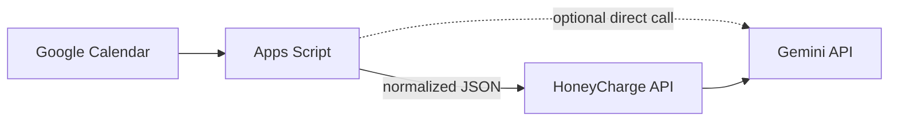

# Google Apps Script Integration (Future-Compatible Reference)

**Status: NOT deployed. Reference/documentation only (§12, §17 of the spec).**
Nothing in this document is required to run the current HoneyCharge
validation platform — the live `/validation` dashboard and
`runFixedVsAdaptiveBacktest` work entirely on synthetic data today. This
document exists so a future integration with a real Google Calendar can
be added without changing any domain logic.

## Why Apps Script, and why later

Google Apps Script can run as a lightweight, serverless adapter that reads
a user's real Google Calendar and forwards a **data-minimized** summary to
HoneyCharge. It is optional and interchangeable: the domain layer
(`lib/domain/mobility/departurePrediction.ts`) only ever consumes
`NormalizedCalendarEvent[]` — it has no idea whether that array came from
Apps Script, a direct OAuth integration, or a test fixture.



Two supported shapes:

1. **Apps Script -> HoneyCharge only** (recommended): Apps Script
   normalizes and forwards events; HoneyCharge's own server calls Gemini
   (via `getAIService()`), keeping the Gemini key in exactly one place.
2. **Apps Script -> Gemini directly**: shown in `examples/apps-script/gemini.gs`
   for completeness, but not the default — it would duplicate the API key
   and the prompt/schema logic in two places, which is exactly what
   `lib/services/ai/config.ts`'s centralization rule (§7) exists to avoid.

## Normalized calendar event schema

Matches `lib/domain/calendar/types.ts::NormalizedCalendarEvent` exactly:

```json
{
  "id": "string",
  "start": "2026-08-24T09:00:00+09:00",
  "end": "2026-08-24T10:00:00+09:00",
  "allDay": false,
  "location": "string (optional, omitted unless the user enabled location sharing)"
}
```

Never included: attendees, description, attachments, meeting notes,
conferencing links, contact details (§10). `examples/apps-script/calendar.gs`
enforces this by only ever reading `event.getStartTime()`,
`event.getEndTime()`, `event.isAllDayEvent()`, and — conditionally —
`event.getLocation()`.

## HoneyCharge endpoint this integration targets

```
POST /api/ai/calendar/analyze
Content-Type: application/json

{
  "event": <NormalizedCalendarEvent>,
  "mobilityProfile": <MobilityProfile>,
  "nowIso": "2026-08-24T06:00:00+09:00"
}
```

Response (always 200 with a best-effort result — see fallback below):

```json
{
  "mobilityRelevant": true,
  "vehicleNeedProbability": 0.8,
  "confidence": 0.7,
  "reasons": ["..."],
  "source": "gemini" | "fallback"
}
```

Implemented in `app/api/ai/calendar/analyze/route.ts`, backed by
`GeminiProvider.classifyCalendarEvent`.

## Authentication (not yet implemented — required before real deployment)

The current endpoint has no auth check, matching the rest of this MVP
(§ REQUIREMENTS.md: "no separate API keys required" for the base app).
Before wiring this to a real user's calendar:

- Add a shared secret or per-user token, checked in
  `app/api/ai/calendar/analyze/route.ts`, e.g. an `Authorization: Bearer`
  header compared against a value in `HONEYCHARGE_APPS_SCRIPT_TOKEN`.
- Store that token in Apps Script's `PropertiesService`
  (`examples/apps-script/config.gs`), never hardcoded in the script.
- Rate-limit or otherwise bound calls per user to control Gemini cost (§95).

## Error handling

| Failure | Apps Script behavior |
|---|---|
| HoneyCharge endpoint unreachable | Log via `console.error`, skip this sync cycle, retry on the next trigger |
| Non-200 response | Log the status/body, skip this event |
| Gemini unavailable server-side | Transparent to Apps Script — the endpoint still returns 200 with `"source": "fallback"` (§9) |

## Privacy policy

- Only `start`, `end`, `allDay`, and (opt-in) `location` ever leave Google
  Calendar.
- `location` is included only when the user has explicitly enabled
  location sharing (mirrors `UserMobilityPreferences.calendarLocationEnabled`
  in `lib/domain/mobility/types.ts`).
- No calendar data is persisted by HoneyCharge beyond the single request
  used to compute a `CalendarMobilityAnalysis` — see §44 (the audit log
  records the classification outcome, not the source event).

## Future trigger-based sync

Apps Script supports installable time-driven or calendar-update triggers.
The intended flow (§84, not implemented):

```
Calendar update trigger fires
  -> re-read upcoming events (next 36h, matching departurePrediction's lookahead)
  -> normalize each event
  -> compare against the last-synced snapshot
  -> if the mobility-relevant window changed, POST the changed event(s) to
     /api/ai/calendar/analyze
  -> HoneyCharge's client-side engine (lib/services/validationEngine.ts)
     re-runs predictDeparture -> calculateGuaranteedSoc -> buildAdaptiveSchedule
```

A trigger does not need to (and should not) assume it receives a diff of
what changed — Apps Script should always re-normalize the full upcoming
window and let HoneyCharge's own comparison logic decide what changed,
exactly like the `/validation` dashboard's "일정 변경 추가" scenario button
does today with a manually-injected event.

## Reference scripts

See `examples/apps-script/`. These are **not deployed** and have never
made a real network call as part of this implementation — they are
plain-text references showing the intended shape of a future integration.
