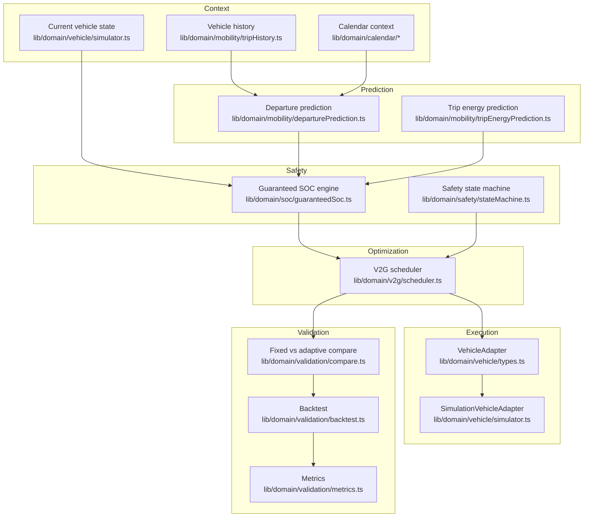

# Architecture

## Layering (§4)

These layers are never collapsed into one giant service or one AI prompt
(§4). Each has a single-file (or small-module) owner, is independently
importable, and — critically — independently unit-tested
(`tests/domain/*.test.mjs`).

## Where this lives relative to the existing app

HoneyCharge already shipped a grid-operator dashboard
(`components/HoneyChargeApp.tsx`) and a consumer mobile app
(`components/mobile/**`), both backed by a single-day, fixed-schedule,
rule-based scheduler (`lib/services/v2gScheduler.ts`) operating across 32
synthetic fleet vehicles. This implementation is **additive**: everything
described in this document lives under `lib/domain/**`,
`lib/services/ai/**`, `lib/services/validationEngine.ts`,
`app/validation/**`, `app/api/{ai,validation}/**`, and
`components/validation/**`. None of the existing dashboard/mobile code
paths were modified — see `docs/implementation-audit.md` for the full
inventory of what was reused vs. added.

## Runtime

- Next.js App Router (via the `vinext` adapter) on Cloudflare
  Workers/Pages, same as the rest of the app.
- The domain layer (`lib/domain/**`) has zero framework or Node-only
  dependencies — it runs identically in `node --test` (via `tsx`) and in
  the browser. The `/validation` dashboard runs the entire prediction ->
  SOC -> scheduling pipeline **client-side**; only the optional Gemini
  calendar classification crosses to a server API route, so the Gemini
  API key never reaches the browser (§7).
- `app/api/validation/backtest/route.ts` runs the same domain code
  server-side for the batch fixed-vs-adaptive experiment, since 30 days ×
  N trips of scheduling is cheap but there's no reason to duplicate it in
  two places — the dashboard just fetches it.

## Data flow for one "tick" of the live dashboard

1. `computeSnapshot()` (`lib/services/validationEngine.ts`) reads the
   current simulated vehicle state and trip history.
2. Builds a `MobilityProfile`, runs `predictDeparture` and
   `predictTripEnergy`.
3. Combines their confidences (conservative minimum) into
   `calculateGuaranteedSoc`.
4. Runs `evaluateSafetyState` from the current SOC vs. that guarantee.
5. Runs `buildAdaptiveSchedule` over a 24h/30-min horizon, respecting the
   safety state.
6. The dashboard renders the result — every number on screen traces back
   to one of these five steps, nothing is hardcoded (§77).

See `docs/mobility-prediction.md`, `docs/guaranteed-soc.md`,
`docs/v2g-optimizer.md` for the algorithms themselves.
